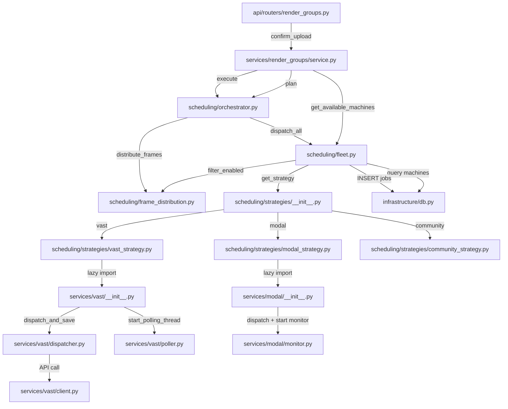
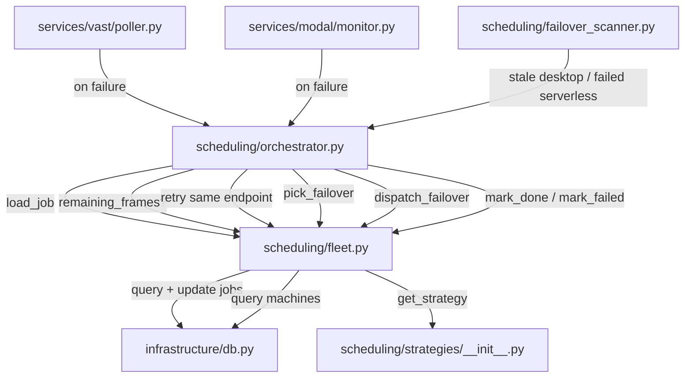
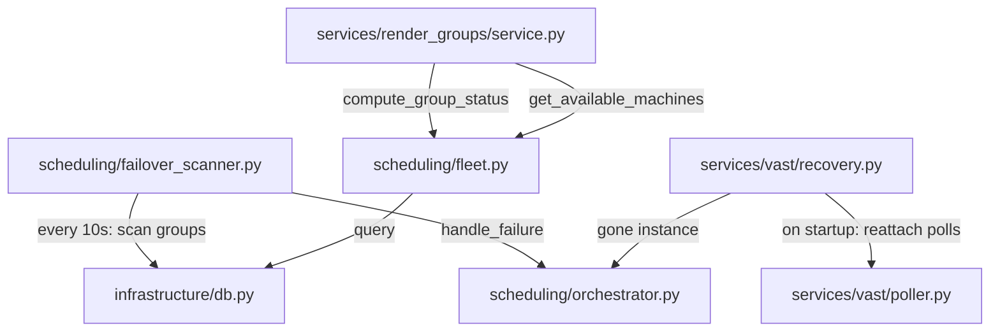

# Render Job Lifecycle — Call Graphs

## 1. Dispatch Path (render request comes in)

---

## 2. Failure Path (job fails, retry/failover)

---

## 3. Background + Status

---

## File Map

| File | Lines | Role |
|---|---|---|
| `scheduling/orchestrator.py` | ~145 | **WHAT** — plan, execute, handle_failure |
| `scheduling/fleet.py` | ~450 | **HOW** — DB writes, dispatch threads, failover selection, machine queries, status aggregation |
| `scheduling/frame_distribution.py` | ~265 | Pure math — scoring, budgeting, splitting frames |
| `scheduling/failover_scanner.py` | ~243 | Background daemon — detects stale/orphaned jobs |
| `scheduling/strategies/` | | Provider adapters — Modal, Vast, Community |
| `models/` | | Pure data — RenderJob, RenderGroup, value objects |
| `services/render_groups/service.py` | | HTTP-facing service — calls orchestrator |

---

## Key Design Decisions

| Decision | Why |
|---|---|
| Orchestrator is WHAT, Fleet is HOW | Anyone can read `orchestrator.py` and understand the full lifecycle in 145 lines |
| GET is read-only | All mutation happens via FailoverScanner or explicit POST calls |
| Orchestrator is stateless | Every call re-reads from DB; no in-memory job ownership |
| Provider threading is per-strategy | Modal = thread-per-job, Vast = sequential thread with 2s gap, Community = no-op |
| Retry cap is per-range, not per-job | A frame range stops at 5 failed attempts to prevent infinite GPU burn |
| blend_url is per-provider | Each strategy's service module has its own PUBLIC_BACKEND_URL |
